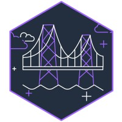
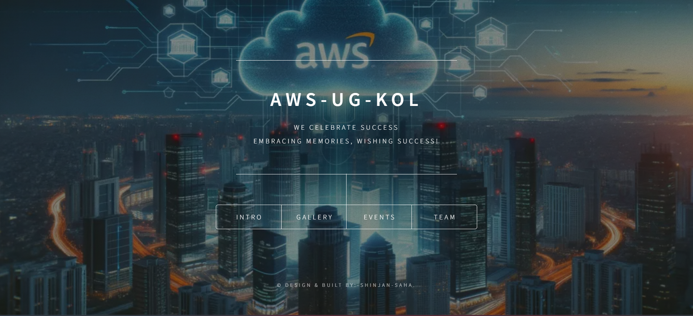
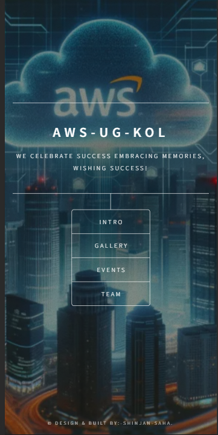
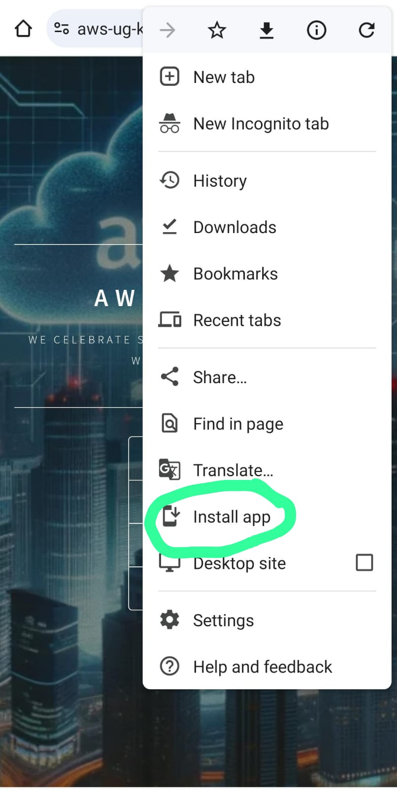

# AWS-UG-KOL

Website For AWS USer Group Kolkata

 

## Tools & Language Used in the Website:-
<ul>
<li></li>
<li></li>  
<li></li>
<li></li>
<li></li>
</ul>

## Preview Of Website in Desktop

## Preview of Website in Mobile

## It also has an PWA(Progressive Web App ) 
### How to Install it:-
#### Simply open it in chrome or any Browser & Click the 3 dot button & click "Install App"

## Visit The Website Here:-
[Visit Here!](https://aws-ug-kol.vercel.app/)

## It also Vercel Analytics Enable 
#### So We can see how many people has visited the Website, they are from where & from which devices they have visited 